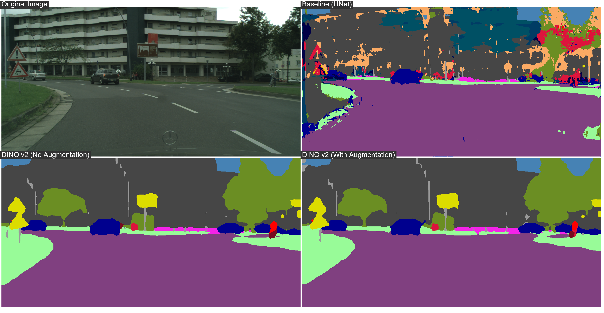

# Setup Instructions

## Course Developer Info

**Snellius Username:** `scur2416`  
**TUE Email:** `p.rempakos@student.tue.nl`

This guide is for the 5LSM0 course at TU/e.

## Overview

This repository implements a robust semantic segmentation model using **DINOv2** with advanced augmentation techniques for the Cityscapes dataset. The model studies robustness and the impact of four augmentation techniques on performance. Namely, these are a combination of Fourier-space augmentations, copy-paste, frequency band dropout, and semantic style swapping.

The approach is compared to a baseline **UNet** model provided by the course instructors, available at the [original repository](https://github.com/TUE-ARIA/NNCV).



## Prerequisites

- Python 3.11+
- Conda/Miniconda (if using it instead of venv)
- ~10GB disk space
- Optional: Docker for submission, CUDA 12.1 for GPU training

## 0. Clone the Repository

```bash
git clone https://github.com/rempakos/NNCV.git
cd NNCV
```

All subsequent commands should be run from inside the cloned directory.

## 1. Install Environment

```bash
python -m venv venv
venv\Scripts\activate  # Windows
source venv/bin/activate  # Linux/macOS
pip install -r requirements.txt
```

Or with Conda:

```bash
conda env create -f environment.yml
conda activate nncv-final-assignment
```

Verify: `python -c "import torch; import timm; print('OK')"`

## 1a. Setup Environment Variables

Copy the template file and adjust with your credentials:

```bash
cp _env .env
nano .env  # or use your preferred editor
```

Update the placeholders in `.env`:

```env
# Weights and Biases API
WANDB_API_KEY=<your-wandb-api-key>
WANDB_DIR=<path-to-wandb-directory>
WANDB_CONFIG_DIR=<path-to-wandb-directory>
WANDB_CACHE_DIR=<path-to-wandb-directory>
WANDB_START_METHOD="thread"

# HuggingFace Token (for dataset download)
HF_TOKEN=<your-huggingface-api-key>
```

**Required**: `HF_TOKEN` (for downloading dataset from HuggingFace)  
**Optional**: `WANDB_*` variables (can login interactively during training)

## 1b. Setup W&B (Weights & Biases)

Create a free account at [wandb.ai](https://wandb.ai) and get your API key from settings.

When you run training (via `bash main.sh` or `python train.py`), you'll be prompted to login:

```bash
wandb login
# Paste your API key when prompted
```

This logs your training metrics to your W&B project.

## 2. Download Dataset

### Option A: From HuggingFace (If you have credentials)

```bash
hf auth login --token your-hf-token
hf download TimJaspersUe/5LSM0 --local-dir ./data --repo-type dataset
```

### Option B: Manual Setup

If you cannot download from HuggingFace, prepare Cityscapes locally with this structure:

```
data/
├── cityscapes/
│   ├── leftImg8bit/
│   │   ├── train/
│   │   └── val/
│   └── gtFine/
│       ├── train/
│       └── val/
```

Ensure `config.py` points to the correct dataset path:

```python
DATA_DIR = "./data/cityscapes"  # Update if needed
```

### Option C: On HPC Clusters (Snellius)

```bash
bash download_docker_and_data.sh
```

Requires HF_TOKEN in `.env`.

## 3. Training

### On HPC Clusters (Snellius):

Use SLURM job submission instead of running directly:

```bash
sbatch jobscript_slurm.sh
```

### On Local Machine:

**Option 1**: Use training script (recommended):

Activate environment and run:

```bash
# Activate environment
venv\Scripts\activate  # Windows
source venv/bin/activate  # Linux/macOS

# Run training script
bash main.sh
```

This installs dependencies, prompts for wandb login, and trains with parameters from `main.sh` which match `config.py` defaults (80 epochs, batch size 4, all augmentations enabled). Note: `main.sh` parameters supercede `config.py` values.

To modify training parameters, either:

- Edit `main.sh` before running (change `--epochs`, `--batch-size`, etc.)
- Edit `config.py` and run `python train.py` directly

**Option 2**: Manual training (direct control):

All hyperparameters are defined in `config.py`. Run directly with:

```bash
python train.py --experiment-id my-exp
```

To override config values via command line:

```bash
python train.py --epochs 1 --batch-size 2 --experiment-id test
```

Or edit `config.py` directly and then run `python train.py`.

**Augmentations**: Edit `config.py` to enable/disable:

- `APPLY_FOURIER` - Fourier space augmentation
- `APPLY_COPYPASTE` - Copy-paste augmentation
- `APPLY_FREQ_BAND_DROPOUT` - Frequency band dropout
- `APPLY_SEMANTIC_STYLE_SWAP` - Semantic style transfer

Checkpoints: `checkpoints/<experiment-id>/`

## 4. Visualization & Comparison

**Compare models** (requires 3 pre-trained models in `models/` folder):

Models expected at:

```
models/
├── baseline/model.pt
├── dino_model_without_augmentation/model.pt
└── dino_model_with_augmentation/model.pt
```

Compare predictions on sample images:

```bash
python compare_models.py --image sample_data/aachen_000000_000019_leftImg8bit.png --output comparison.png
```

Available sample images: `sample_data/aachen_000000_000019_leftImg8bit.png` through `aachen_000051_000019_leftImg8bit.png`

Or use custom image:

```bash
python compare_models.py --image /path/to/your/image.png --output comparison.png
```

**Visualize single model** (trained checkpoint):

```bash
python visualize.py --checkpoint checkpoints/my-exp/model.pt --image sample_data/aachen_000000_000019_leftImg8bit.png
```

## 5. Docker Submission

**Step 1**: Prepare for submission - edit `predict.py` !!!

Change line with `Model(pretrained=True)` to `Model(pretrained=False)` !!!

```python
model = Model(pretrained=False)  # Already trained, don't download weights
```

**IMPORTANT**:

- `pretrained=True` is needed during training to load pre-trained DINOv2 weights from HuggingFace
- **MUST be `False` for submission** because the submission server cannot access HuggingFace. Instead, `model.pt` already contains all weights.

**Step 2**: Copy your best trained checkpoint as `model.pt`:

```bash
cp checkpoints/my-exp/best_model.pt model.pt
```

**Step 3**: Build Docker image:

```bash
docker build --no-cache -t my-submission:latest .
```

**Step 4**: Test locally before submission:

```bash
mkdir local_data local_output

# Copy test images
cp sample_data/*.png local_data/

# Run Docker container
docker run --rm -v "${PWD}\local_data:/data" -v "${PWD}\local_output:/output" my-submission:latest
```

Check that segmentation masks were created in `local_output/` with same filenames as inputs.

**Step 5**: Export for submission:

```bash
docker save my-submission:latest -o my-submission.tar
```

## Notes

- Training without GPU is very slow
- Check GPU: `python -c "import torch; print(torch.cuda.is_available())"`
- Install CUDA 12.1 from [NVIDIA](https://developer.nvidia.com/cuda-12-1-0-download-wizard) if needed
- Ensure `model.pt` exists before Docker build
- **For SLURM cluster work**: Create `.env` file in project root with:

  ```
  HF_TOKEN=your_huggingface_token_here
  ```

  This is used by `download_docker_and_data.sh` and `jobscript_slurm.sh`

- For SLURM cluster submission: `jobscript_slurm.sh` submits training jobs to the HPC cluster
- For cluster data download: Use `download_docker_and_data.sh` to pull the Apptainer container and download dataset on HPC (requires HF_TOKEN in `.env`)
